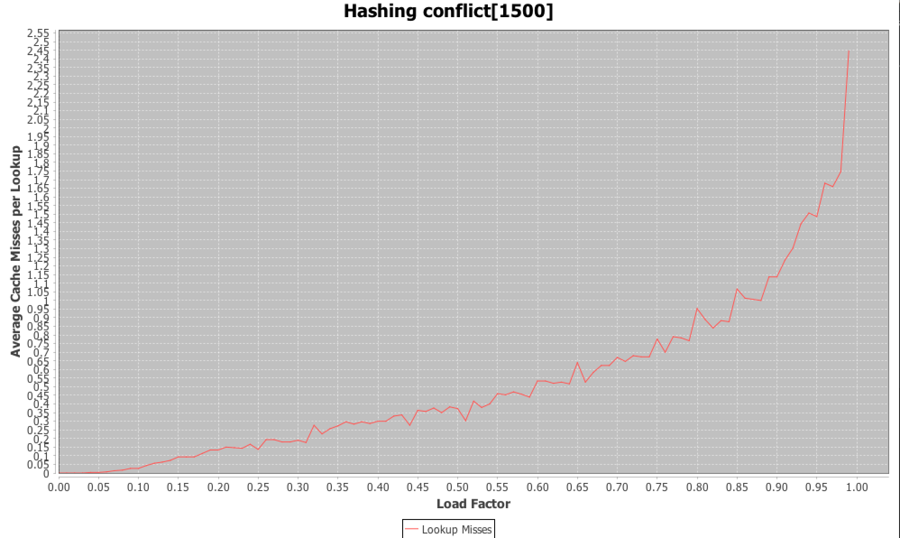

**Purpose**: 0.75 is the common used load factor to determining 
if a hash table needs rehashing. The project draw a chart to show the lookup misses
when load factor increases. 

**Result**: For a hash table with 1500 buckets. The program do 300 lookups per 
load factor and find the average misses. The diagram looks like,

